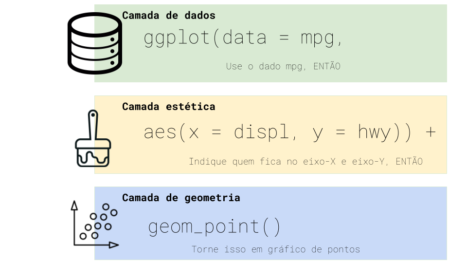

class: center, middle, animated slideInRight fadeOutLeft, animated slideInRight fadeOutLeft

```{r setup, include=FALSE}

knitr::opts_chunk$set(echo = TRUE, message = FALSE,
                      warning = FALSE)
library(magick)
library(fontawesome)

```


```{r xaringan-scribble, echo=FALSE}
xaringanExtra::use_scribble()
```

```{r share-again, echo=FALSE}
xaringanExtra::use_share_again()
```

```{r xaringan-logo, echo=FALSE}
xaringanExtra::use_logo(
  image_url = "ofb.png", 
  position = xaringanExtra::css_position(top = NULL, right = '1em', 
                                         left = NULL, bottom = '1em')
)
```

```{r xaringanExtra-clipboard, echo=FALSE}
xaringanExtra::use_clipboard()

```

```{r xaringan-animate-css, echo=FALSE}
xaringanExtra::use_animate_css(xaringan = FALSE)
```

```{r xaringan-painelset, echo=FALSE}
xaringanExtra::use_panelset()

```

```{r xaringan-extra-styles, echo=FALSE}
xaringanExtra::use_extra_styles(
  hover_code_line = TRUE,         #<<
  mute_unhighlighted_code = FALSE  #<<
)
```

```{r xaringanExtra, echo = FALSE}
xaringanExtra::use_progress_bar(color = "#0b2e4d", location = "top", 
                                height = "10px")
```

Para acessar esse documento:

```{r, echo=FALSE, fig.align='center'}

url <- "https://gerriosantos.github.io/ufc_minicurso_ecofin/#1"
plot(qrcode::qr_code(url, ecl = 'M'), col = c('white', '#0b2e4d'))

```


---
class: center, middle, animated slideInRight fadeOutLeft, animated slideInRight fadeOutLeft

# Introdução

---

# O que é o R?


É uma linguagem de programação de computadores utilizada principalmente
para manipulação de dados e visualização de gráficos. `R` é uma linguagem de código aberto criada em 1993 pelo departamento de Estatística da Universidade de Auckland (pelos estatísticos     **R**oss Ihaka e **R**obert Gentleman), Nova Zelândia, baseada na linguagem `S` (criada por John Chambers Rick Becker e Allan Wilks em 1976, na Bell Labs).

O `R` é escrito principalmente em `C`, `C++` e `Fortran`, sendo disponível gratuitamente sob a licença GNU General Public e em vários sistemas operacionais como `MAC`, `Windows` e `Linux.`

O `R` usa uma _Integrated Development Environment_ (IDE) própria, com interface não muito amigável. Porém, há algumas interfaces que podem ser integradas ao software que ajudam a melhorar o visual.


---
# Por que usar R?

- _Open Source_:

    - É grátis.
    - Todos podem usar as mesmas ferramentas, independente de condições finaceiras e/ou sociais.
    - Podemos desenvolver nossas próprias ferramentas.
    - Podemos aprimorar ferramentas já disponíveis pela comunidade `R`.

- Linguagem simples e fácil de entender.

- Facilidade em se conectar a linguagens de programação de alto desempenho como `C`, `Fortran` e `C++`.

- Possui grande comunidade, que é diversificada e acolhedora. 

- Muitos pacotes.

- Ferramentas poderosas como `Rmarkdown` e `shiny`.

- Tem a IDE `Rstudio`, que facilita a interação com os dados.
---
class: center, middle, animated slideInRight fadeOutLeft, animated slideInRight fadeOutLeft

# Instalação - R e RStudio
---

# Instalação para Windows

- [Software R](https://cran.r-project.org/)

- [RStudio Descktop](https://posit.co/download/rstudio-desktop/)

# Instalação Linux e MacOs

- [Linux](https://cran.r-project.org/)

- [MacOS](https://cran.r-project.org/)

# Livro da Curso-R

- [Ciência de Dados em R](https://livro.curso-r.com/1-1-instalacao-do-r.html)


---
class: center, middle, animated slideInRight fadeOutLeft

# Operações Básicas no R

---

# Operações Principais

```{r, echo=FALSE, }

readr::read_rds('df_operacoes.rds') |> 
  knitr::kable(align = 'c') |> 
  kableExtra::kable_styling(font_size = 16)
```
---

# Objetos

- Basicamente, é um nome que guarda um valor.

```{r}
meu_objeto <- 1
```

```{r}
meu_objeto + 2
```

- Não usar em nomes de objetos:

    - números (por exemplo, `1teste`)
    - alguns simbolos especiais, como `^`, `!`, `$`, `@`, `+`, `-`, `/`, `*`
    - Palavras reservadas, como por exemplo `if`, `for`, etc.

- `R` é _case-sensitive_ (diferencia minúscula de maiúscula).
---
class: center, middle, animated slideInRight fadeOutLeft

# Estruturas de Dados para Armazenar Elementos


---
# Vetores

- Armazenam elementos unidimensionais de mesmo tipo de dados, como `numeric`, `logical`, `character`.

```{r, eval=FALSE}
c(2, 3, 4)
2:4
c('a', 'b', 'c')
c(T, F, T)
```

```{r, eval=FALSE}
seq(2, 5, by = 1)
seq(2, 5, by = 0.5)
rep(1:3, times = 2)
rep(1:3, each =  2)
# Combinando as duas funções
rep(seq(2,3, 0.5), times = 2)
```

---
# Listas

- As listas contém elementos/dados de diferentes tipos e dimensões. Uma lista pode conter um vetor de `numeric`, `character`, `data.frame` e uma outra `list`. 


```{r, eval=FALSE}

list(c(1,2), c('a', 'b', 'c'), data.frame(a = c(1,2,3), b = c('a', 'b', 'c')))

```

---
class: center, middle, animated slideInRight fadeOutLeft

# Introdução a Ciência de Dados
---

# Ciclo de Ciência de Dados

```{r, echo=FALSE, fig.align='center', out.width = '90%'}


```


---
class: center, middle, animated slideInRight fadeOutLeft

# R Base

---

- A funcionalidade do **`R`** é dividida em vários pacotes:

    - **`R base`** _package_  com as funções fundamentais.

    - Outros pacotes contidos no sistema **`R base`**: `utils`, `stats`, `datasets`, `graphics`, `grDevices`, `grid`, `methods`, `tools`, `parallel`, `compiler`, `splines`, `tcltk`, `stats4`.
    
    - Pacotes "recomendados": `boot`, `class`, `cluster`, `codetools`, `foreign`, `KernSmooth`, `lattice`, `mgcv`, `nlme`, `rpart`, `survival`, `MASS`, `spatial`, `nnet`, `Matrix`.
    

```{r, eval=FALSE}

sqrt(x = 16)

unique(x = c(1,2,1,2,2,2,4,4))

log(1)

plot(x = rnorm(n = 1000, mean = 250, sd = 50))

```


---

## Acessar Help


```{r, eval=FALSE}

# Procura documentação da função e seus argumentos

help(mean)
?mean

# Procura pelo nome (string) na documetação do R
help.search('mean')

# Procurar pacote
help(package = 'dplyr')

# Acessar funções do pacote usando `::`

dplyr::select()

```
---


## Usar Pacotes

```{r, eval=FALSE}
# Carregando o pacote
> library(dplyr)
Error in library(dplyr) : there is no package called ‘dplyr’

```


```{r, eval=FALSE}

# Download para baixar pacotes
install.packages('dplyr')

# Carregando o pacote
library(dplyr)

# Usar uma função particular de um pacote
dplyr::select()

# Baixar bases de dados já existentes no R
data(iris)
iris
```
---
```{r, echo=FALSE, fig.align='center', out.width = '80%'}
knitr::include_graphics('imagens/tidyverse.png')

```

---


# tibble

- Um `data.frame()` melhorado. A função `tibble` permite melhor visualização dos dados no console.


- Variáveis

- Observações

- Valores

- Uma `tibble` pode ser transformada em `data.frame` e vice-versa. Para isso, usam-se as funções `as.data.frame` e `as_tibble`, respectivamente.


---
# readr, readxl, openxlsx


.pull-left[

```{r, eval=FALSE}

# readr
read_csv()

read_csv2()

read_delim()

read_rds()

# readxl
read_xlsx()

read_xls()

#openxlsx
read.xlsx()

```


]


.pull-right[

```{r, eval=FALSE}

# readr
write_csv()

write_csv2()

write_delim()

write_rds()

# writexl

write_xlsx()

# openxlsx
write.xlsx()

```

]

- **Mostrar exemplo no R**


---
# dplyr

```{r, echo=FALSE}

readr::read_rds('tabelas/tab_dplyr.rds') |> data.frame() |> 
  knitr::kable()

```
---

## `filter()`

- filtrando linhas

```{r eval=FALSE}

filter(df, sigla_uf ==  'CE' & nome = 'Coreaú')

filter(df, sigla_uf ==  'CE' & sigla_uf = 'PB')

filter(df, sigla_uf %in% c('CE', 'PB'))


```


---


## `select()`

- selecionando variáveis

```{r eval=FALSE}

select(df, var1, var2, var3, var4, var5)

select(df, c(var1, var2))

select(df, var1:var3)

select(df, !c(var1:var3))

select(df, ends_with('3'))

select(df, contains('2'))

select(df, starts_with("var") & !ends_with("4"))


```

- O `select()` também permite renomear. 


```{r eval=FALSE}

select(df, nome_novo = var1, var2, var3, var4, var5)

```

---
## `rename()`

 - As linhas não são afetadas.

 - Os nomes das colunas são alterados; a ordem das colunas é preservada.

- Os atributos do quadro de dados são preservados.

- Os grupos são atualizados para refletir os novos nomes.

```{r eval=FALSE}

rename(df, nome_novo = nome_antigo)

```

---

## `mutate()`

- Criando novas colunas

```{r eval=FALSE}

mutate(df, ddd1 = ifelse(ddd == 88, 1, 0))

mutate(df, valor_1 = valor / 1000000000)

```


```{r eval=FALSE}
# Uso da função lambda
mutate(df, across(.cols = everything(), ~ .fns = as.character(.x)))
```
---

## `group_by` e `summarise`

- Essas funções são, na maioria das vezes, usadas conjuntamente. O `group_by` faz agregações e o `summarise` faz resumos (por exemplo, médias de valores) ao nível do agrupamento que foi escolhido (por exemplo, por ano, estado, etc.) 


```{r eval=FALSE}

df |> group_by(sigla_uf) |> 
  summarise(n = n(),
            media = mean(valor),
            sd = sd(valor))

```

- Usando `across`

```{r eval=FALSE}
df |> 
  group_by(sigla_uf) |> 
  summarise(
    n = n(),
    
    across(
      .cols = c(nota_saeb_lp, nota_saeb_mt),
      ~ .fns = mean(.x, na.rm = TRUE))
    
  )

```


---
# tidyr

```{r, eval=FALSE}

# Dados longitudinal para cross-section
pivot_wider(df, names_from = ano, values_from = nota_mt)

```

```{r, eval=FALSE}

# cross-section para longitudinal
pivot_longer(df, cols = -id_municipio, names_to = 'ano', values_to = 'notas_mt')

```


```{r, eval=FALSE}

# Apagando os NAs
df |> 
  drop_na()

df |> 
  drop_na(var1, var1)

```

---
# ggplot2

```{r, echo=FALSE, fig.align='center', out.width = '60%'}


```


- [The R Graph Gallery](https://r-graph-gallery.com/)


---

# Miscelânea 

1. Juntar as bases do Finbra e Inep, com as colunas de despesa com educação e Ideb e fazer um gráfico scatter plot para analisar a relação entre despesa e qualidade do ensino no ano de 2019.

2. Fazer um mapa do estado do Ceará com Ideb e outro com a despesa per capita com educação para o ano de 2019.

3. Fazer um gráfico com a série de tempo de despesas per capita de 2013 a 2020.

---

### Referências

- [R for Data Science](https://r4ds.had.co.nz/)

- [Ciência de Dados em R](https://livro.curso-r.com/index.html)

- [Usando R nas Ciências Sociais](https://robsonol.github.io/workshop_r_ciencias_sociais/#/title-slide)


